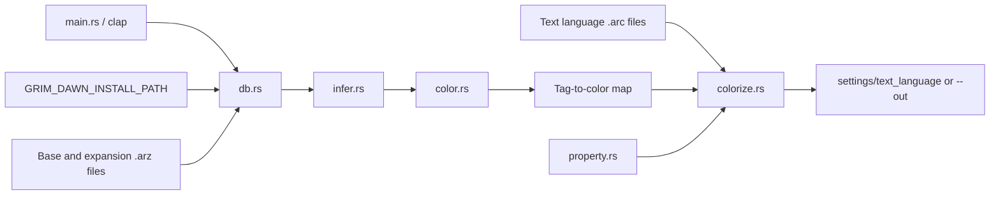

# Architecture

This document describes the implementation at commit `b0a9042cbba84d3681cb993b3015e645c17ff4f3` (2026-07-30), not a proposed design.

## Runtime topology and components

gdse is a single-process Rust CLI. It has no server, persistence database, cache, authentication layer, telemetry, or background concurrency. Its security boundary is the local user's filesystem access: it reads a user-selected game installation and writes localization overrides to either a user-selected directory or that installation's `settings` directory.

### Responsibilities and dependency direction

- `src/main.rs::main` is the composition root: parses `Args`, normalizes the language, selects `DamageColors`, and chooses the output path.
- `src/db.rs::install_path`, `open_all`, and `iter_records` adapt `lib_gddb` archives to the application. The repository depends directly on a Git-pinned `lib_gddb` revision.
- `src/infer.rs::infer` scans item records, identifies affix and base-name tags, selects the modal rarity for shared tags, and marks names that require an explicit base color.
- `src/color.rs::color_for` maps inferred metadata to rarity palette entries. `src/property.rs::color_for` independently derives damage-label colors from stable tag-name tokens.
- `src/colorize.rs::run` orchestrates text archive reads, rewriting, directory creation, and output. Its private `recolor_file` and `apply_color` functions form the serialization boundary.
- `src/palette.rs` is a leaf module containing Grim Dawn color-code constants.

Dependencies point from orchestration toward parsing/inference and pure mapping functions. There are no abstractions for filesystem operations, process termination, or archive readers.

## Primary control and data flow

1. Clap parses arguments. `GRIM_DAWN_INSTALL_PATH` is canonicalized; a missing or invalid value terminates the process.
2. `db::open_all` attempts the base and three expansion databases in load order, skipping ones it cannot open and terminating only if none open.
3. `infer::infer` requests all `records/items/` records. Affix records become direct tag classifications; other item records contribute rarity counts, faction/gear membership, and style/quality relationships.
4. Shared item tags receive their modal rarity (ties choose the lower tier). Only eligible non-faction gear names and affixes receive a color through `color::color_for`.
5. `colorize::run` tries language archives in base/expansion load order. It filters archive records to tag text files, decodes bytes lossily as UTF-8, and rewrites tag values selected by either the inferred map or `property::color_for`.
6. Changed files are written whole beneath the output directory. Existing unrelated or now-obsolete files are not reconciled.

There are no retries or transactions. Archive/database errors are mostly skipped; output directory and file-write errors print to stderr and exit. Output writes are not atomic. Processing is sequential.

## Important invariants and compatibility constraints

- Input text comes from pristine game archives rather than existing output, preventing repeated color insertion.
- Localization records use `tag=value`; the first `=` is the boundary. Comments, blank lines, untouched content, and CRLF/LF endings are intended to survive rewriting.
- Inline color markers have the four-byte ASCII form `{^X}`. Placeholder, bracket, `$`, and pipe-prefix placement rules intentionally mirror WanezGD behavior.
- Expansion databases and language archives are optional, but inability to distinguish “absent” from “corrupt/unreadable” is a known limitation.
- Game tag keys, not translated values, drive damage coloring. Value parsing is therefore language-independent except for lossy UTF-8 decoding.

## Build, deployment, and external dependencies

Cargo is the build and dependency manager. `clap` provides argument parsing; `lib_gddb` reads Grim Dawn `.arz` and `.arc` formats. Deployment is a locally built executable. There is no CI or release/package configuration in the examined tree. Runtime integration is entirely through proprietary Grim Dawn files and filesystem output.

## Known limitations and unresolved questions

- See `AUD-001` through `AUD-004` in `docs/AUDIT.md` for absent coverage, suppressed input failures, non-atomic/stale output behavior, and eager record collection.
- Game 1.3.0 on Linux and English are the only combinations documented as tested. Windows and other localizations remain unverified.
- The required minimum supported Rust version is not declared.
- It is unverified whether archive record identifiers are guaranteed by `lib_gddb` to be normalized, relative paths; this matters before treating them as output paths.

## Proposed future architecture

No architectural change is approved. The incremental proposals in `docs/AUDIT.md` favor pure-function characterization tests, explicit error propagation, and staged output writes rather than a rewrite.
