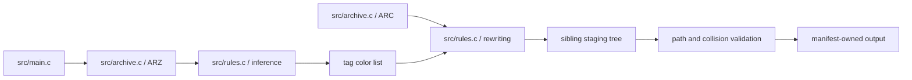

# Architecture

## Runtime topology

gdse is a single-process ISO C89 CLI with no network, service, persistence database, telemetry, or concurrency. It reads a local Grim Dawn installation and publishes localization overrides.

## Components and dependencies

- `src/main.c` is the composition root. It parses options, enforces mandatory/optional input policy, stages a complete output set, detects collisions, writes the ownership manifest, and publishes with backup/rollback.
- `src/archive.c` implements the required version-3 `.arz` and `.arc` readers. It validates sizes and indexes, uses vendored LZ4 for payloads, and resolves one record at a time rather than collecting raw/resolved record vectors.
- `src/rules.c` accumulates inference state, resolves modal rarity ties toward the lower tier, maps property tags, preserves Unicode alphabetic handling through utf8proc, and rewrites localization lines.
- `src/util.c` contains checked allocation, little-endian reads, directory creation, joins, and archive-path containment checks.
- `src/gdse.h` is an internal interface; this executable exposes no supported library ABI.
- `vendor/lz4` and `vendor/utf8proc` are isolated third-party implementations with included licenses.
- Platform-dependent filesystem and large-file calls are isolated behind `_WIN32` adapters: MinGW uses `_stat`, `_mkdir`, `_rmdir`, `_fseeki64`, and `_ftelli64`; non-Windows builds use their C/POSIX counterparts. The Makefile selects Windows command syntax and `.exe` targets when `OS=Windows_NT`.

## Control and data flow

1. The CLI requires and validates the positional `GRIM_DAWN_INSTALL_PATH` argument, then parses the remaining options.
2. The base database is mandatory. DLC databases are skipped only if absent; malformed or unreadable existing databases fail the run.
3. ARZ record offsets and the string table are indexed once. Relevant item records are decompressed individually and folded into linked inference state, bounding transient payload memory to one record.
4. The base requested-language ARC is mandatory. DLC archives follow the same absent-versus-broken policy.
5. Relevant tag files are decoded as byte-preserving UTF-8 text and rewritten. CRLF, LF, and missing final newline are preserved. Invalid UTF-8 bytes are retained; utf8proc is used only to decide whether a plain value contains a Unicode letter.
6. Every output is first written beneath a sibling staging path. Absolute, parent-traversing, or empty path components and duplicate destinations are rejected before publication.
7. Publication backs up existing owned destinations, renames staged files into place, and rolls them back on failure. `.gdse-manifest` limits stale cleanup to files generated by gdse; unrelated files are never deleted.

## Compatibility and limitations

- Inline color markers retain the four-byte `{^X}` format and the Rust implementation's placement ordering.
- Supported ARZ and ARC format version is 3, matching the former `lib_gddb` dependency.
- Full-directory atomic replacement is intentionally avoided because output may coexist with unrelated files. Individual renames are atomic where the filesystem provides that guarantee; the backup rollback protects multi-file publication failures on a best-effort basis.
- Real game archives, Windows behavior, non-English archives, and crash injection during filesystem publication remain unverified in this checkout.
