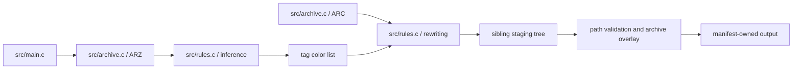

# Architecture

## Runtime topology

gdse is a single-process ISO C89 CLI with no network, service, persistence database, telemetry, or concurrency. It reads a local Grim Dawn installation and publishes localization overrides.

## Components and dependencies

- `src/main.c` is the composition root. It parses options, enforces mandatory/optional input policy, stages a complete output set, lets a later archive replace an earlier staged destination, writes the ownership manifest, and publishes with backup/rollback.
- `src/archive.c` implements the required version-3 `.arz` and `.arc` readers. It validates sizes and indexes, uses vendored LZ4 for payloads, and resolves one record at a time rather than collecting raw/resolved record vectors. String fields may hold an array, which is decoded as one field per element; `gd_record_field` answers with the first, so readers expecting a single value are unaffected.
- `src/rules.c` accumulates inference state in dynamically resized hash indexes, deduplicates identical part/base relationships, resolves modal rarity ties toward the lower tier, maps property tags, preserves Unicode alphabetic handling through utf8proc, and rewrites localization lines. It carries two item color models: gdse's own, which colors only names that can take a name-altering affix, and `--full-rainbow`, which colors every modeled rarity, marks set items, includes faction gear, paints style/quality words silver, and colors Monster Infrequents by resolving monster drop slots through loot tables back to item tags, keeping only the Rare-and-above results so a monster's own worn gear is not mistaken for its Infrequent. Shared world-drop pools are excluded by their `loottables/mastertables/` path, except for the few records there that only one or two creatures name, which are a single boss's own table.
- `src/util.c` contains checked allocation, little-endian reads, directory creation, joins, and archive-path containment checks.
- `src/gdse.h` is an internal interface; this executable exposes no supported library ABI.
- `vendor/lz4` and `vendor/utf8proc` are isolated third-party implementations with included licenses.
- Platform-dependent filesystem and large-file calls are isolated behind `_WIN32` adapters: MinGW uses `_stat`, `_mkdir`, `_rmdir`, `_fseeki64`, and `_ftelli64`; non-Windows builds use their C/POSIX counterparts. The Makefile selects `.exe` targets when `OS=Windows_NT`, but selects recipe syntax independently from `SHELL` so MSYS2's POSIX shell never receives native `cmd.exe` conditionals.

## Control and data flow

1. The CLI parses the optional positional `GRIM_DAWN_INSTALL_PATH` and remaining options; it defaults the install path to the current directory, the language to English, Rainbow Filter damage colors to enabled, and the wider Rainbow Filter item scheme (`--full-rainbow`) to disabled, then validates the selected directory and its mandatory inputs.
2. The base database is mandatory. DLC databases are skipped only if absent; malformed or unreadable existing databases fail the run.
3. ARZ record offsets and the string table are indexed once. Relevant item records are decompressed individually and folded into hash-indexed inference state, bounding transient payload memory to one record while keeping tag insertion and lookup amortized constant-time. `--full-rainbow` additionally decompresses `records/creatures/` — about 5,200 records against the item subtree's tens of thousands — to recover which loot tables monsters drop from; without the flag those records are skipped on their id alone.
4. The base requested-language ARC is mandatory. DLC archives follow the same absent-versus-broken policy.
5. Relevant tag files are decoded as byte-preserving UTF-8 text and rewritten. Existing line separators are normalized to Windows CRLF, while a missing final newline remains missing. Invalid UTF-8 bytes are retained; utf8proc is used only to decide whether a plain value contains a Unicode letter.
6. Every output is first written beneath a sibling staging path. Absolute, parent-traversing, or empty path components are rejected before publication; when archives contain the same destination, the later archive replaces the earlier staged output.
7. Publication backs up existing owned destinations, renames staged files into place, and rolls them back on failure. `.gdse-manifest` limits stale cleanup to files generated by gdse; unrelated files are never deleted.

## Compatibility and limitations

- Inline color markers retain the four-byte `{^X}` format and the Rust implementation's placement ordering.
- `--full-rainbow` derives item decisions from the database and carries no per-item table: `itemClassification`, blueprint `forcedRandomArtifactName`, `itemSetName`, the faction record path and the style/quality tag fields for the item categories, and monster or named boss-chest references resolved through loot tables for Monster Infrequents. Two localization-category exclusions keep random-crafting result labels and Loyalist illusion equipment uncolored, matching their roles rather than enumerating individual items.
- `--full-rainbow` reproduces the Rainbow Filter scheme closely but not exactly. The supplied game-version-1.3.0 outputs show 149 differences for the original database-only rule, 29 after the first specialized traversal, and 19 after the first missing-record fallbacks. Category exclusions, category colors, corrected family fallbacks, `Broken` enemy-gear handling, and traversal of specialized `LevelTable.records` paths reduce the latest captured comparison to a projected 11 color-only differences. Generic tier paths remain excluded so ordinary Epic and Legendary pools do not become Monster Infrequents. `docs/AUDIT.md` records the full accounting.
- Supported ARZ and ARC format version is 3, matching the former `lib_gddb` dependency.
- Full-directory atomic replacement is intentionally avoided because output may coexist with unrelated files. Individual renames are atomic where the filesystem provides that guarantee; the backup rollback protects multi-file publication failures on a best-effort basis.
- Real game archives, Windows behavior, non-English archives, and crash injection during filesystem publication remain unverified in this checkout.
